# NAIM PRO domain model

Status: proposed architecture only. This document does not create a database
schema, migration, ORM model, authentication flow, or server function.

## 1. Domain overview

NAIM PRO is one business today, but every business record will be scoped to an
`Organization` from the first migration. The initial deployment creates one
organization row. This adds a small amount of foreign-key and query discipline
now while avoiding an expensive tenant retrofit later.

The system is a modular monolith with these domain boundaries:

- Identity and access: users, organization memberships, roles, and sessions.
- Parties and fleet: vendors, transporters, drivers, vehicles, destination
  companies, materials, and locations.
- Commercial: Deals are purchase agreements with vendors.
- Logistics: Trips are individual physical movements under one Deal.
- Finance: payments, allocations, bills, receipts, reversals, and settlement
  snapshots.
- Documents: logical documents, immutable file versions, and relational links.
- Configuration: versioned custom fields for non-core business variation.
- Operations and compliance: activity, notifications, and append-only audit.

### Tenancy decision

Introduce `Organization` now and require `organization_id` on all business
data. `User` is a global login identity; `OrganizationMembership` connects a
user to an organization and owns that user's role in that organization.

Benefits:

- One user can later belong to more than one organization with a different role.
- Tenant filters and composite foreign keys are designed in rather than added
  after data exists.
- Sessions can bind to a server-validated active membership.
- Backups, exports, audit, and future row-level security have a clear scope.

Costs:

- Queries and uniqueness constraints include `organization_id`.
- Child relations need composite foreign keys or transactional validation to
  prove that all referenced rows belong to the same organization.
- Authorization must never trust a client-provided organization identifier.

This is not a SaaS model: there is no subscription, billing plan, tenant signup,
cross-organization administration, or tenant switching workflow in scope.

## 2. Entity list

### Identity and tenancy

- `Organization`
- `User`
- `OrganizationMembership`
- `Session`

### Parties, fleet, and reference data

- `Vendor`
- `Transporter`
- `Driver`
- `Vehicle`
- `Company` (the destination/customer company, not the tenant Organization)
- `Material`
- `Location`
- `DriverTransporterAssignment`
- `VehicleTransporterAssignment`

### Commercial and logistics

- `Deal`
- `DealStatusEvent`
- `Trip`
- `TripAssignment`
- `TripStatusEvent`
- `TripSettlement`

### Finance and billing

- `Payment`
- `PaymentAllocation`
- `Bill`
- `BillLine`

### Documents and configuration

- `Document`
- `DocumentVersion`
- `DocumentAttachment`
- `FormConfiguration`
- `FormSection`
- `CustomFieldDefinition`
- `CustomFieldDefinitionVersion`
- `CustomFieldOption`
- `CustomFieldVisibleRole`
- `CustomFieldEditableRole`
- `CustomFieldValue`

### Operations and compliance

- `ActivityEvent`
- `AuditEvent`
- `Notification`

## 3. Entity relationships

```mermaid
erDiagram
  ORGANIZATION ||--o{ ORGANIZATION_MEMBERSHIP : has
  USER_ACCOUNT ||--o{ ORGANIZATION_MEMBERSHIP : joins
  USER_ACCOUNT ||--o{ SESSION : authenticates
  ORGANIZATION_MEMBERSHIP ||--o{ SESSION : activates

  ORGANIZATION ||--o{ VENDOR : owns
  ORGANIZATION ||--o{ TRANSPORTER : owns
  ORGANIZATION ||--o{ DRIVER : owns
  ORGANIZATION ||--o{ VEHICLE : owns
  ORGANIZATION ||--o{ COMPANY : owns
  ORGANIZATION ||--o{ MATERIAL : owns
  ORGANIZATION ||--o{ LOCATION : owns
  USER_ACCOUNT o|--o{ VENDOR : optional_login
  USER_ACCOUNT o|--o{ DRIVER : optional_login
  TRANSPORTER ||--o{ DRIVER_TRANSPORTER_ASSIGNMENT : engages
  DRIVER ||--o{ DRIVER_TRANSPORTER_ASSIGNMENT : history
  TRANSPORTER ||--o{ VEHICLE_TRANSPORTER_ASSIGNMENT : operates
  VEHICLE ||--o{ VEHICLE_TRANSPORTER_ASSIGNMENT : history

  VENDOR ||--o{ DEAL : supplies
  MATERIAL ||--o{ DEAL : specifies
  LOCATION ||--o{ DEAL : pickup
  ORGANIZATION_MEMBERSHIP ||--o{ DEAL : owns
  DEAL ||--o{ DEAL_STATUS_EVENT : transitions
  DEAL ||--o{ TRIP : contains

  TRIP ||--o{ TRIP_ASSIGNMENT : assignment_history
  TRANSPORTER ||--o{ TRIP_ASSIGNMENT : fulfills
  DRIVER ||--o{ TRIP_ASSIGNMENT : drives
  VEHICLE ||--o{ TRIP_ASSIGNMENT : carries
  COMPANY ||--o{ TRIP : destination_company
  LOCATION ||--o{ TRIP : pickup_or_destination
  TRIP ||--o{ TRIP_STATUS_EVENT : transitions
  TRIP ||--o{ TRIP_SETTLEMENT : settlement_revisions

  PAYMENT ||--o{ PAYMENT_ALLOCATION : allocates
  DEAL o|--o{ PAYMENT_ALLOCATION : target
  TRIP o|--o{ PAYMENT_ALLOCATION : target
  BILL o|--o{ PAYMENT_ALLOCATION : target
  COMPANY ||--o{ BILL : billed_to
  BILL ||--|{ BILL_LINE : contains
  TRIP ||--o{ BILL_LINE : bills

  DOCUMENT ||--|{ DOCUMENT_VERSION : versions
  DOCUMENT ||--o{ DOCUMENT_ATTACHMENT : links
  DEAL o|--o{ DOCUMENT_ATTACHMENT : attached
  TRIP o|--o{ DOCUMENT_ATTACHMENT : attached
  PAYMENT o|--o{ DOCUMENT_ATTACHMENT : attached
  BILL o|--o{ DOCUMENT_ATTACHMENT : attached
  VEHICLE o|--o{ DOCUMENT_ATTACHMENT : attached
  VENDOR o|--o{ DOCUMENT_ATTACHMENT : attached
  DRIVER o|--o{ DOCUMENT_ATTACHMENT : attached
  TRANSPORTER o|--o{ DOCUMENT_ATTACHMENT : attached
  COMPANY o|--o{ DOCUMENT_ATTACHMENT : attached

  FORM_CONFIGURATION ||--|{ FORM_SECTION : contains
  CUSTOM_FIELD_DEFINITION ||--|{ CUSTOM_FIELD_DEFINITION_VERSION : versions
  FORM_SECTION ||--o{ CUSTOM_FIELD_DEFINITION_VERSION : places
  CUSTOM_FIELD_DEFINITION_VERSION ||--o{ CUSTOM_FIELD_OPTION : options
  CUSTOM_FIELD_DEFINITION_VERSION ||--o{ CUSTOM_FIELD_VISIBLE_ROLE : visible_to
  CUSTOM_FIELD_DEFINITION_VERSION ||--o{ CUSTOM_FIELD_EDITABLE_ROLE : editable_by
  CUSTOM_FIELD_DEFINITION_VERSION ||--o{ CUSTOM_FIELD_VALUE : validates
  DEAL o|--o{ CUSTOM_FIELD_VALUE : target
  TRIP o|--o{ CUSTOM_FIELD_VALUE : target
  VENDOR o|--o{ CUSTOM_FIELD_VALUE : target
  DRIVER o|--o{ CUSTOM_FIELD_VALUE : target
  PAYMENT o|--o{ CUSTOM_FIELD_VALUE : target
```



`DocumentAttachment` and `CustomFieldValue` use explicit nullable foreign keys
for their supported targets, with a check requiring exactly one target. They do
not use an unchecked `entity_type + entity_id` polymorphic reference.

## 4. Proposed columns and types

PostgreSQL `uuid` is the proposed identifier type. UUIDs should be generated by
the application using a time-ordered UUID implementation supported by the final
runtime; database identity is not coupled to a particular PostgreSQL major
version. Store instants as `timestamptz`, calendar-only dates as `date`, and
exact measurements and currency as constrained `numeric`, never float/double.
PostgreSQL documents `numeric(p,s)` as exact, selectable-precision storage.
See [PostgreSQL numeric types](https://www.postgresql.org/docs/current/datatype-numeric.html).

### Shared conventions

| Concern              | Proposed representation                                             |
| -------------------- | ------------------------------------------------------------------- |
| Primary key          | `id uuid primary key`                                               |
| Tenant scope         | `organization_id uuid not null`                                     |
| Created/updated time | `created_at timestamptz`, `updated_at timestamptz`                  |
| Actor                | `created_by_membership_id`, `updated_by_membership_id` where scoped |
| Optimistic lock      | `version integer not null default 1 check (version > 0)`            |
| Lifecycle values     | `text` plus named `CHECK` constraints; not unrestricted text        |
| Weight               | `numeric(12,3)` metric tons, nonnegative                            |
| Rate                 | `numeric(14,2)` INR per metric ton, nonnegative                     |
| Money                | `numeric(16,2)` plus `currency char(3) default 'INR'`               |
| Percentage           | `numeric(9,4)` when snapshotted                                     |
| Names/search keys    | Display `text` plus normalized companion value where needed         |
| Archive              | Explicit status and/or `archived_at`, `archived_by_membership_id`   |

Every organization-scoped parent should expose a unique key on
`(organization_id, id)`. Children should use composite foreign keys such as
`(organization_id, deal_id) -> deal(organization_id, id)`. This makes
cross-organization references invalid at the database boundary, not merely in
application code.

### Identity and tenancy

#### `organization`

| Column                     | Type and rule                         |
| -------------------------- | ------------------------------------- |
| `id`                       | `uuid`, primary key                   |
| `name`                     | `text`, nonblank                      |
| `legal_name`               | `text`, nullable                      |
| `status`                   | `text`, `ACTIVE` or `INACTIVE`        |
| `created_by_user_id`       | Nullable user FK for system bootstrap |
| `created_at`, `updated_at` | `timestamptz`                         |
| `version`                  | Positive integer                      |

The first deployment creates exactly one organization through controlled setup.
Application code must not assume its ID is a global constant.

#### `user_account`

| Column                     | Type and rule                                          |
| -------------------------- | ------------------------------------------------------ |
| `id`                       | `uuid`, primary key                                    |
| `phone_e164`               | `text`, globally unique, normalized before persistence |
| `password_hash`            | `text`, never plaintext and never returned to clients  |
| `status`                   | `text`, `ACTIVE` or `INACTIVE`                         |
| `must_change_password`     | `boolean`, default false                               |
| `last_login_at`            | `timestamptz`, nullable                                |
| `created_by_user_id`       | Nullable self-FK; null only for bootstrap/system       |
| `created_at`, `updated_at` | `timestamptz`                                          |
| `version`                  | Positive integer                                       |

`phone_e164` should satisfy an E.164-shaped constraint such as
`^\+[1-9][0-9]{7,14}$`; parsing and normalization still happen server-side.
Passwords use a modern password hash such as Argon2id with algorithm parameters
encoded in the hash string.

Password reset is admin-controlled: an authorized admin sets a temporary
password, `must_change_password` becomes true, all existing sessions are
revoked, and an audit event is written in the same transaction. There is no OTP
or email reset token model.

#### `organization_membership`

| Column                             | Type and rule                              |
| ---------------------------------- | ------------------------------------------ |
| `id`, `organization_id`, `user_id` | UUIDs; unique `(organization_id, user_id)` |
| `role`                             | `ADMIN`, `MEMBER`, `VENDOR`, or `DRIVER`   |
| `status`                           | `ACTIVE` or `INACTIVE`                     |
| `created_by_membership_id`         | Nullable only for bootstrap                |
| `created_at`, `updated_at`         | `timestamptz`                              |
| `version`                          | Positive integer                           |

Role belongs to membership, not directly to User. This allows the same login to
hold a different role in another organization later. Version one permits one
role per organization membership; multiple simultaneous roles remain an open
decision.

#### `session`

| Column                                     | Type and rule                                     |
| ------------------------------------------ | ------------------------------------------------- |
| `id`                                       | `uuid`, primary key                               |
| `user_id`, `active_membership_id`          | Required UUID FKs; membership must belong to user |
| `token_hash`                               | `text`, unique; never store the raw cookie token  |
| `created_at`, `expires_at`, `last_seen_at` | `timestamptz`                                     |
| `revoked_at`                               | `timestamptz`, nullable                           |
| `created_ip`, `last_seen_ip`               | `inet`, nullable                                  |
| `user_agent`                               | `text`, nullable and length-limited               |

Sessions are server-side records. The browser receives an opaque token in a
finite-lived `HttpOnly`, `Secure`, `SameSite` cookie. Rotate/revoke sessions on
login, logout, password reset/change, membership status change, and role change.

### Parties, fleet, and reference data

All party tables include the shared organization, actor, timestamp, version,
and archive fields.

| Entity        | Important columns and constraints                                                                                                               |
| ------------- | ----------------------------------------------------------------------------------------------------------------------------------------------- |
| `vendor`      | `name`, `normalized_name`, optional `user_id`, phone/contact fields, notes, status; unique `(organization_id, user_id)` when linked             |
| `transporter` | `name`, `normalized_name`, contact fields, notes, status                                                                                        |
| `driver`      | `name`, `normalized_name`, `phone_e164`, optional `user_id`, licence metadata where later required, status; unique linked user per organization |
| `vehicle`     | display and normalized registration number, vehicle metadata, status; unique `(organization_id, registration_number_normalized)`                |
| `company`     | destination/customer name, normalized name, contact/billing metadata, status                                                                    |
| `material`    | name, normalized name, description, status; unique active normalized name per organization                                                      |
| `location`    | name, normalized name, address fields, optional latitude `numeric(9,6)`, longitude `numeric(9,6)`, status                                       |

Vendor and Driver are business identities, not login identities. Their optional
`user_id` links are access grants. A Vendor or Driver can exist without a User,
and disabling login must not remove or archive its business record.

`driver_transporter_assignment` and `vehicle_transporter_assignment` contain:

- `organization_id`, the two entity foreign keys, `valid_from`, and nullable
  `valid_to`.
- `created_by_membership_id`, `created_at`, and an optional reason.
- A partial unique constraint allowing only one open assignment per Driver or
  Vehicle where the business requires exclusivity.

There is no permanent Driver-to-Vehicle ownership. A Trip captures the actual
combination assigned to that movement.

### Deal

| Column                                                 | Type and rule                                           |
| ------------------------------------------------------ | ------------------------------------------------------- |
| `id`, `organization_id`                                | UUID and tenant scope                                   |
| `deal_number`                                          | Human-readable identifier, unique per organization      |
| `vendor_id`                                            | Required same-organization Vendor FK                    |
| `pickup_location_id`                                   | Required same-organization Location FK                  |
| `material_id`                                          | Required same-organization Material FK                  |
| `purchase_rate_per_mt`                                 | `numeric(14,2)`, nonnegative                            |
| `expected_quantity_mt`                                 | `numeric(12,3)`, nullable and nonnegative               |
| `owner_membership_id`                                  | Active `ADMIN`/`MEMBER` membership in organization      |
| `status`                                               | `DRAFT`, `ACTIVE`, `FULFILLED`, `CANCELLED`, `ARCHIVED` |
| `notes`                                                | `text`, nullable                                        |
| `created_by_membership_id`, `updated_by_membership_id` | Actor FKs                                               |
| `created_at`, `updated_at`, `archived_at`              | `timestamptz`                                           |
| `version`                                              | Positive optimistic-lock integer                        |

`deal_status_event` is append-only and contains Deal, from/to status, explicit
domain action, actor, reason, timestamp, and resulting Deal version.

### Trip

| Column                                                 | Type and rule                                               |
| ------------------------------------------------------ | ----------------------------------------------------------- |
| `id`, `organization_id`, `deal_id`                     | UUIDs; Deal is immutable and same-organization              |
| `trip_number`                                          | Human-readable identifier, unique per organization          |
| `destination_company_id`                               | Required same-organization Company FK                       |
| `pickup_location_id`                                   | Required Location FK, initially defaulted from Deal         |
| `destination_location_id`                              | Required Location FK                                        |
| `loaded_weight_mt`                                     | `numeric(12,3)`, nullable until loading; nonnegative        |
| `final_weight_mt`                                      | `numeric(12,3)`, nullable until delivery; nonnegative       |
| `accepted_final_weight_mt`                             | `numeric(12,3)`, nullable until settlement; nonnegative     |
| `delivery_challan_number`                              | `text`, nullable until dispatch; normalized companion value |
| `weighment_card_number`                                | `text`, nullable until delivery; normalized companion value |
| `dispatched_at`, `delivered_at`                        | `timestamptz`, set by lifecycle actions                     |
| `status`                                               | One of the nine required Trip states                        |
| `owner_membership_id`                                  | Assigned operational member                                 |
| `created_by_membership_id`, `updated_by_membership_id` | Actor FKs                                                   |
| `created_at`, `updated_at`, `archived_at`              | `timestamptz`                                               |
| `version`                                              | Positive optimistic-lock integer                            |

Transporter, Driver, and Vehicle are temporal relations through
`trip_assignment`, not permanent columns silently overwritten on Trip:

| `trip_assignment` column                    | Type and rule                                |
| ------------------------------------------- | -------------------------------------------- |
| `trip_id`, `organization_id`                | Same-organization Trip reference             |
| `transporter_id`, `driver_id`, `vehicle_id` | Required same-organization references        |
| `assigned_at`, `ended_at`                   | `timestamptz`; null `ended_at` means current |
| `assigned_by_membership_id`                 | Actor membership                             |
| `reason`                                    | Required for a post-assignment correction    |
| `created_at`                                | `timestamptz`                                |

A partial unique index on `trip_id WHERE ended_at IS NULL` permits one current
assignment. Reassignment ends the prior row and inserts a new row in one
transaction, preserving historical Driver access and operational history.

`trip_status_event` stores the append-only transition history: Trip, from/to
status, domain action, actor, reason, timestamp, and resulting Trip version.

## 5. Lifecycle and state machines

### Deal lifecycle

| From        | Allowed target | Domain action and guard                                            |
| ----------- | -------------- | ------------------------------------------------------------------ |
| `DRAFT`     | `ACTIVE`       | Activate after Vendor, Material, pickup, rate, and owner are valid |
| `DRAFT`     | `CANCELLED`    | Cancel an unused draft with reason                                 |
| `ACTIVE`    | `FULFILLED`    | Close after required Trips and financial obligations are resolved  |
| `FULFILLED` | `ARCHIVED`     | Archive after retention/operational checks                         |
| `CANCELLED` | `ARCHIVED`     | Archive cancelled agreement                                        |

No free-form update writes a Deal status. Cancellation after active Trips exist
is intentionally unresolved pending a product cancellation policy.

Vendor, Material, pickup Location, and purchase rate are freely editable only in
`DRAFT`. After activation, any commercial change uses an explicit Deal-amendment
action with reason, expected version, and audit. A rate amendment is forbidden
once a related Trip reaches `SETTLEMENT_PENDING`; already posted TripSettlement
snapshots always retain their original rate.

### Trip lifecycle

```text
CREATED
  -> TRUCK_ASSIGNED
  -> LOADING
  -> LOADED
  -> IN_TRANSIT
  -> DELIVERED
  -> SETTLEMENT_PENDING
  -> SETTLED
  -> ARCHIVED
```

| Transition                        | Required conditions                                                                      |
| --------------------------------- | ---------------------------------------------------------------------------------------- |
| `CREATED -> TRUCK_ASSIGNED`       | One active assignment with valid Transporter, Driver, and Vehicle                        |
| `TRUCK_ASSIGNED -> LOADING`       | Assignment confirmed; Deal remains active                                                |
| `LOADING -> LOADED`               | Loaded weight recorded and greater than zero; required loading evidence policy satisfied |
| `LOADED -> IN_TRANSIT`            | Delivery challan and dispatch timestamp recorded; active assignment present              |
| `IN_TRANSIT -> DELIVERED`         | Final weight, weighment card, and delivered timestamp recorded                           |
| `DELIVERED -> SETTLEMENT_PENDING` | Delivery data verified and accepted final weight determined                              |
| `SETTLEMENT_PENDING -> SETTLED`   | Immutable active settlement snapshot posted and required approvals satisfied             |
| `SETTLED -> ARCHIVED`             | No unresolved reversal, payment, document, or audit exception                            |

Status transitions are explicit domain actions. Each action validates the
expected current status and `version`, updates Trip, inserts
`TripStatusEvent`, and inserts `AuditEvent` in one transaction.

### Field mutability by stage

| Fields                                           | Restriction                                                                                                                                               |
| ------------------------------------------------ | --------------------------------------------------------------------------------------------------------------------------------------------------------- |
| `organization_id`, `deal_id`, `trip_number`      | Immutable after Trip creation                                                                                                                             |
| destination and pickup                           | Freely editable only in `CREATED`; controlled correction with reason afterward                                                                            |
| Transporter/Driver/Vehicle                       | New temporal assignment allowed through `TRUCK_ASSIGNED`; after `LOADING`, correction requires elevated permission, reason, assignment history, and audit |
| `loaded_weight_mt`                               | Required to enter `LOADED`; after `IN_TRANSIT`, correction requires explicit weight-correction action and audit                                           |
| challan and dispatch time                        | Required before `IN_TRANSIT`; correction after dispatch is explicit and audited                                                                           |
| `final_weight_mt`, weighment card, delivery time | Required for `DELIVERED`; correction after `SETTLEMENT_PENDING` requires settlement re-evaluation                                                         |
| accepted weight and purchase rate snapshot       | Fixed by settlement; never silently overwritten                                                                                                           |
| settled financial data                           | Reversal/adjustment only                                                                                                                                  |
| archived Trip                                    | No ordinary edits; an explicit admin restore policy is required before any correction                                                                     |

There is currently no `CANCELLED`, `FAILED`, or `RETURNED` Trip state. Product
input is required before handling aborted movements; `ARCHIVED` must not be used
as a disguised cancellation.

## 6. Weight and financial model

### Precision

- Weights: `numeric(12,3)` metric tons.
- Purchase rates: `numeric(14,2)` INR per metric ton.
- Monetary amounts: `numeric(16,2)` INR.
- Percentages: calculate with adequate intermediate precision and round to
  `numeric(9,4)` only at the declared presentation/snapshot boundary.

### Authoritative calculations

```text
weightDifference = loadedWeight - finalWeight

weightDifferencePercent =
  loadedWeight > 0
    ? weightDifference / loadedWeight * 100
    : undefined

purchaseAmount = acceptedFinalWeight * purchaseRate

vendorBalance = purchaseAmount - allocatedVendorPayments
```

- Before settlement, weight difference, percentage, provisional purchase
  amount, balances, and outstanding receivables are computed on read from
  authoritative stored inputs and posted allocations.
- Same-row derived values may later use PostgreSQL generated columns, but they
  are not required. Generated columns cannot reference other rows and cannot be
  written directly; see [PostgreSQL generated columns](https://www.postgresql.org/docs/current/ddl-generated-columns.html).
- Cross-table balances are never stored as editable columns.
- At settlement, persist an immutable `trip_settlement` snapshot containing
  loaded weight, final weight, accepted final weight, applied purchase rate,
  weight difference, difference percent, purchase amount, actor, timestamp, and
  source Trip version.
- If settlement inputs were wrong, reverse the active settlement with reason and
  post a replacement snapshot. Do not update the posted snapshot in place.

### Payment model

`payment` is a business cash/bank movement, not a mutable balance or advance
field.

| Column                                        | Type and rule                                                              |
| --------------------------------------------- | -------------------------------------------------------------------------- |
| `organization_id`, `payment_number`           | Tenant scope; internal number unique per organization                      |
| `direction`                                   | `OUTGOING` or `INCOMING`                                                   |
| `type`                                        | `ADVANCE`, `PARTIAL`, `FINAL`, `REFUND`, `ADJUSTMENT`                      |
| `vendor_id`, `transporter_id`, `company_id`   | Explicit nullable FKs; exactly one counterparty                            |
| `amount`, `currency`                          | Positive `numeric(16,2)`, currency fixed to `INR` initially                |
| `payment_date`                                | `date`                                                                     |
| `payment_mode`                                | Constrained text such as `CASH`, `BANK_TRANSFER`, `CHEQUE`, `UPI`, `OTHER` |
| `receipt_number`                              | Nullable external/reference number plus normalized form                    |
| `status`                                      | `DRAFT`, `POSTED`, or `REVERSED`                                           |
| `recorded_by_membership_id`                   | Required actor                                                             |
| `paid_by_membership_id`                       | Nullable responsible member for outgoing payment                           |
| `reversal_of_payment_id`                      | Nullable unique self-reference                                             |
| `reversal_reason`, `posted_at`, `reversed_at` | Required as applicable                                                     |
| timestamps/version                            | Shared fields                                                              |

Use the three explicit counterparty foreign keys instead of a generic
`PartyAccount(type, id)` or enterprise ledger abstraction. The supported flows
are currently narrow and asymmetric, so explicit Vendor/Transporter/Company FKs
provide real referential integrity and readable authorization. If double-entry
accounting or additional counterparties become a requirement, introduce a
separate accounting subledger rather than weakening these business references.

Direction and counterparty must agree: Vendor/Transporter are normally outgoing;
Company is incoming. Refund/adjustment actions may invert the normal direction
but require an explicit reason and permission.

`payment_allocation` distributes one posted Payment across one or more targets:

- `payment_id`, `organization_id`, `amount numeric(16,2) > 0`.
- Exactly one explicit target FK: `deal_id`, `trip_id`, or `bill_id`.
- Actor and timestamp.
- Sum of active allocations may not exceed Payment amount.
- Vendor allocations must target a Deal or Trip for the same Vendor.
- Transporter allocations must target a Trip associated with that Transporter.
- Company receipts must target a Bill for that Company.

Allocation sum and counterparty checks cross rows/tables, so enforce them in a
transaction that locks the Payment and relevant targets. Database triggers may
provide defense in depth, but ordinary `CHECK` constraints cannot safely enforce
arbitrary cross-row conditions.

Posted Payments and allocations are immutable. Correction posts a reversing
Payment and, when needed, a replacement Payment/allocation set. The business
mutation and its audit event commit or roll back together.

### Billing and company receivables

Bill is a separate invoice entity. It does not belong exclusively to Deal or
Trip because one Company bill may aggregate several delivered Trips.

| Entity      | Important columns                                                                                                                                                                   |
| ----------- | ----------------------------------------------------------------------------------------------------------------------------------------------------------------------------------- |
| `bill`      | Organization, Company, bill number/date, status `DRAFT/ISSUED/VOID`, total `numeric(16,2)`, currency INR, issued/void actor and timestamps, replacement/reversal reference, version |
| `bill_line` | Bill, Trip, description, quantity MT, rate, line amount, `voided_at`; Trip and Bill must share organization and destination Company                                                 |

`Billed?` is derived from an active issued BillLine for the Trip. It is not an
editable boolean on Trip. Billed amount is the sum of active line snapshots.
Company receipts are incoming Payments allocated to Bill. Outstanding
receivable is issued Bill total minus posted incoming allocations plus/minus
posted reversals.

Issued Bills and lines are immutable. Corrections void and replace a Bill rather
than editing its financial history. GST, tax filing, and enterprise accounting
integration are out of scope.

## 7. Documents

Files will live in object storage; PostgreSQL stores identity, metadata,
versions, relationships, and access/audit context.

### `document`

- Organization, document type (`VEHICLE_PHOTO`, `LOADING_PHOTO`,
  `WEIGHBRIDGE_SLIP`, `PAYMENT_RECEIPT`, `DELIVERY_CHALLAN`, `BILL`, `PERMIT`,
  `OTHER`), title/description, status, creator, timestamps, and version.
- Represents the logical document across file replacements.

### `document_version`

- Document, monotonically increasing `version_number`, unique storage key,
  original filename, MIME type, byte size, cryptographic checksum and algorithm,
  uploaded-by membership, and uploaded timestamp.
- Versions are immutable. Replacement creates a new object and row; it never
  overwrites the old object/storage key.

### `document_attachment`

- Organization, Document, creator, and timestamp.
- Explicit nullable foreign keys for Deal, Trip, Payment, Vehicle, Bill, Vendor,
  Driver, Transporter, or Company.
- A database check requires exactly one target FK per attachment row.
- A Document can have multiple attachment rows when intentionally shared.
- Composite FKs enforce same-organization targets.

This design is more verbose than `entity_type/entity_id`, but it retains real
foreign keys, prevents dangling links, supports ownership queries, and makes
authorization reviewable. Add a new nullable target column and constraint when a
new authoritative attachment target is introduced.

## 8. Dynamic fields

Custom fields extend forms; they do not replace core relationships or core
financial/logistics columns.

| Entity                            | Purpose                                                                                                                      |
| --------------------------------- | ---------------------------------------------------------------------------------------------------------------------------- |
| `form_configuration`              | Organization, target type, optional Trip stage, version, `DRAFT/ACTIVE/RETIRED` status                                       |
| `form_section`                    | Configuration, stable key, label, sort order                                                                                 |
| `custom_field_definition`         | Stable Organization-scoped identity: target type, immutable key, active flag                                                 |
| `custom_field_definition_version` | Versioned label, field type, required flag, validation JSON, section, stage, sort order, effective timestamps                |
| `custom_field_option`             | Version-specific stable option code, label, sort order, active flag                                                          |
| `custom_field_visible_role`       | Definition-version and allowed role                                                                                          |
| `custom_field_editable_role`      | Definition-version and allowed role                                                                                          |
| `custom_field_value`              | Organization, definition and exact definition-version, explicit target FK, validated `jsonb` value, actor/timestamps/version |

Allowed target types initially: `DEAL`, `TRIP`, `VENDOR`, `DRIVER`, and
`PAYMENT`. `CustomFieldValue` has explicit nullable FKs for those targets and a
check requiring exactly one. Its JSON value is appropriate because this table
exists specifically for variable typed fields; core entity data remains
relational.

Rules:

- Definition key and identity never change after use.
- Rename/deactivation creates a new definition version or retires the current
  one; historic values retain their original version.
- Field type cannot change incompatibly in place.
- Option codes remain stable; labels can be versioned.
- Server validation uses the version active for the target form/stage and role.
- Database constraints guarantee target/tenant integrity; domain validation
  guarantees value shape and role/stage rules.
- Index custom values only for fields proven to need filtering; do not create a
  generic GIN index by default.

## 9. Activity and audit

### Activity

`activity_event` is a human-readable operational feed:

- Organization, actor membership/user, event type, safe display message or
  template data, timestamp.
- Explicit nullable Deal/Trip/Payment/Document/Bill/Vendor links, with at most
  one primary target and optional correlation ID.
- Contains no password hashes, session tokens, unrestricted request bodies, or
  sensitive before/after financial snapshots.
- Append-oriented, but administrators may redact unsafe display text under an
  audited process. It is not the compliance record.

### Audit

`audit_event` is the compliance/security history:

- `id`, `organization_id`, nullable actor user/membership for system actions.
- Stable `action`, `entity_type`, and `entity_id` identifiers.
- `before_values jsonb` and `after_values jsonb`, with a field allowlist and
  explicit redaction of passwords, session tokens, secrets, and file contents.
- `occurred_at`, request/correlation ID, transaction correlation ID, IP `inet`,
  user agent, and optional reason.
- No foreign key from generic `entity_id`: audit must survive archive and any
  exceptional legal purge of the source record.

Important mutations insert AuditEvent in the same database transaction as the
business write. PostgreSQL triggers execute within the triggering transaction,
so a trigger error rolls back both operations; see
[PostgreSQL trigger behavior](https://www.postgresql.org/docs/current/trigger-definition.html).

Future database protection:

1. Application role receives `INSERT` and `SELECT` only on audit partitions,
   never `UPDATE`, `DELETE`, or `TRUNCATE`.
2. A `BEFORE UPDATE OR DELETE` trigger rejects mutations, owned by a separate
   migration/audit owner.
3. The runtime role must not own or bypass protections on the table.
4. RLS may provide organization-scoped reads, but the application owner and
   superusers can bypass ordinary RLS; it is defense in depth, not absolute
   immutability. PostgreSQL RLS defaults to deny when enabled without an
   applicable policy: [row security policies](https://www.postgresql.org/docs/current/ddl-rowsecurity.html).
5. Consider partitioning by time, restricted retention operations, hash chaining,
   and external write-once export only if compliance requirements justify them.

## 10. Notifications

`notification` is intentionally minimal:

- Organization, recipient User/Membership, constrained type, title, message,
  created timestamp, nullable `read_at`.
- Explicit nullable Deal/Trip/Payment/Document/Bill target FKs with at most one
  primary target.
- Optional deterministic `dedupe_key` unique for an unread trigger instance.
- No delivery-channel or background-job model yet.

Initial types include weight discrepancy, delayed Trip, document uploaded,
payment recorded, delivery confirmed, and required information missing.
Creating a Notification is part of the relevant foreground transaction only
when inexpensive; future background delivery can consume committed domain or
outbox events.

## 11. Archive and delete rules

| Record category                                             | Rule                                                                                 |
| ----------------------------------------------------------- | ------------------------------------------------------------------------------------ |
| Deal and Trip                                               | Status-based `ARCHIVED`; never hard delete                                           |
| Trip assignment/status/settlement history                   | Append-only; never hard delete                                                       |
| Posted Payment/allocation and issued Bill/line              | Never hard delete or overwrite; reversal/void/replacement only                       |
| AuditEvent                                                  | Append-only; no runtime update/delete/truncate permission                            |
| ActivityEvent                                               | Retained; controlled redaction only when necessary and audited                       |
| Document versions                                           | Retain metadata and storage object per retention policy; replacement creates version |
| Vendor/Transporter/Driver/Vehicle/Company/Material/Location | Archive/inactivate; preserve referenced rows                                         |
| User/Membership                                             | Inactivate and revoke sessions; preserve attribution                                 |
| Session                                                     | Revoke; expired session cleanup may hard-delete after security retention period      |
| Draft, never-used configuration                             | Hard delete may be allowed before activation if no value/reference exists            |
| Custom-field definitions after use                          | Retire/version; do not delete historic definition versions                           |

`deleted_at` should not be sprayed across every table. Use meaningful status and
archive fields for domain records. Soft delete is appropriate only when the
business meaning is truly “hidden but recoverable”; it must not bypass lifecycle
or financial reversal rules.

## 12. Constraints and invariants

### Tenant and identity

- Every business row has exactly one Organization.
- Every business relationship is same-organization, enforced with composite FKs
  where possible.
- `phone_e164` is normalized, globally unique, and never used as a mutable
  foreign key.
- Inactive Users or Memberships cannot create sessions or perform operations.
- Vendor/Driver login links require an active membership in the same Organization
  with the matching role.
- A Vendor user can access only the Vendor linked to that User in that
  Organization.
- A Driver can access only current or explicitly permitted historical Trips
  present in TripAssignment history.

### Deal and Trip

- Deal Vendor, Material, pickup Location, and owner belong to Deal Organization.
- Trip belongs to exactly one Deal in the same Organization.
- Trip destination Company and both Locations belong to Trip Organization.
- A current TripAssignment is same-organization and contains valid Transporter,
  Driver, and Vehicle rows.
- There is at most one open TripAssignment per Trip.
- Trip states change only through the declared transition graph.
- Required fields are present before entering their guarded state.
- `dispatched_at <= delivered_at` when both are present.
- Archived Trips cannot be silently edited.
- A Deal and Trip remain separate entities; Trip data is not duplicated into
  Deal.

### Weight and finance

- Weight, expected quantity, rate, amount, and accepted weight cannot be negative.
- Loaded weight must be greater than zero before `LOADED`.
- Percentage calculation is undefined, not infinity, when loaded weight is zero.
- Payment amount and PaymentAllocation amount are greater than zero.
- Active allocations cannot exceed the posted Payment amount.
- Payment counterparty, direction, allocation target, and Organization agree.
- Vendor payment allocations reference only that Vendor's Deal/Trip.
- Company receipts reference only Bills issued to that Company.
- A BillLine Trip destination Company matches the Bill Company.
- There is at most one active settlement snapshot for a Trip.
- `SETTLED` requires an active settlement snapshot.
- Posted/settled/issued financial records require reversal, adjustment, void, or
  replacement—not overwrite.
- Currency is INR unless a future explicit currency decision changes it.

### Documents, configuration, and audit

- Document storage key and `(document_id, version_number)` are unique.
- Document version metadata is immutable.
- DocumentAttachment has exactly one supported target per row.
- CustomFieldValue has exactly one supported target and retains the exact
  definition version used for validation.
- Deactivated or renamed custom fields do not erase historical values.
- Sensitive mutations and lifecycle transitions insert AuditEvent in the same
  transaction.
- Secrets, password hashes, raw session tokens, and unrestricted file contents
  never enter audit before/after JSON.

PostgreSQL `CHECK`, `NOT NULL`, unique, foreign-key, and exclusion constraints
should express row-local and relational invariants wherever possible. Cross-row
aggregates still require locked transactional services and possibly triggers.
See [PostgreSQL constraints](https://www.postgresql.org/docs/current/ddl-constraints.html).

## 13. Search and index plan

Indexes add write/storage cost, so create the baseline B-tree set and add fuzzy
indexes only from observed query plans. PostgreSQL recommends using indexes
sensibly because they improve reads while adding system overhead:
[PostgreSQL indexes](https://www.postgresql.org/docs/current/indexes.html).

### Constraints and baseline B-tree indexes

- Unique `(organization_id, deal_number)` and
  `(organization_id, trip_number)`.
- Unique normalized phone and active linked-user constraints for Vendor/Driver.
- Unique `(organization_id, registration_number_normalized)` for Vehicle.
- Unique `(organization_id, phone_e164)` for non-null Driver phones unless
  product data proves legitimate sharing is required.
- Unique `(organization_id, payment_number)` and
  `(organization_id, bill_number)` for system-issued identifiers.
- Index every referencing FK; PostgreSQL does not automatically index the
  referencing side of foreign keys.
- Deal: `(organization_id, status, created_at desc)`, Vendor, owner, pickup,
  Material.
- Trip: `(organization_id, status, created_at desc)`, Deal, owner,
  `(organization_id, dispatched_at desc)`, destination Company, pickup, and
  destination.
- TripAssignment: unique partial current assignment on Trip; current/history
  indexes by Driver, Vehicle, and Transporter with assignment dates.
- Trip exact references: normalized delivery challan and weighment-card values
  scoped by Organization. Do not mark external numbers unique until their real
  issuing scope is confirmed.
- Vendor, Driver, Transporter, Company, and Location: normalized name plus
  active/archive state scoped by Organization; Driver phone has an exact index.
- Payment: Organization plus status/date, each explicit counterparty/date, and
  normalized receipt number.
- PaymentAllocation: Payment and each target FK.
- Bill: Organization plus Company/status/date; BillLine by Trip and Bill.
- DocumentVersion checksum/storage key; DocumentAttachment indexes for every
  explicit target FK.
- CustomFieldValue partial unique indexes for each supported target plus
  definition.
- Audit: `(organization_id, occurred_at desc)`,
  `(organization_id, entity_type, entity_id, occurred_at desc)`, and actor/date.
- Activity: Organization/date and each commonly used target/date.
- Notification: recipient/date and a partial unread index on
  `(recipient_membership_id, created_at desc) WHERE read_at IS NULL`.

Partial indexes are suitable for current assignments, unread notifications,
active links, and other selective subsets. Their predicates must match actual
query predicates: [PostgreSQL partial indexes](https://www.postgresql.org/docs/current/indexes-partial.html).

### Search strategy

1. Exact IDs/numbers use normalized B-tree equality indexes.
2. Prefix search uses normalized columns and compatible B-tree query patterns.
3. Driver/Vendor/Transporter/Company/Location name search starts with normalized
   prefix matching.
4. If substring/fuzzy search becomes necessary at scale, enable `pg_trgm` and
   add targeted GIN/GiST indexes only to proven fields. `pg_trgm` supports indexed
   similarity and `LIKE`/`ILIKE` searches:
   [PostgreSQL pg_trgm](https://www.postgresql.org/docs/current/pgtrgm.html).
5. Do not introduce Elasticsearch at this stage.

The filter plan directly supports status, date range, Vendor, Vehicle, Driver,
pickup, destination, Transporter, member, and Company. Multicolumn index order
must follow observed leading equality and range predicates rather than creating
every possible combination.

## 14. Concurrency strategy

Use optimistic concurrency for ordinary Deal, Trip, party, and configuration
edits:

1. Client receives `version` with the record.
2. Update uses `WHERE id = ? AND organization_id = ? AND version = ?`.
3. Successful update increments `version` and records updater/time.
4. Zero updated rows returns a conflict, reloads current data, and asks the user
   to reconcile rather than silently overwriting.

Use a database transaction plus row locking for operations with cross-row
invariants:

- Trip state transitions and assignment replacement.
- Settlement posting/reversal.
- Payment posting, allocation, and reversal.
- Bill issue/void/replacement and receipt allocation.
- Admin password reset, role change, and session revocation.

Lock the narrow authoritative rows in a consistent order, re-check all guards
inside the transaction, write status/history/audit records, then commit. Avoid
long transactions around object uploads or user interaction. Use idempotency
keys for payment posting and other retryable mutations so network retries do not
create duplicate financial entries.

## 15. Open decisions

These questions require product input before schema implementation:

1. Can one User hold multiple roles in the same Organization, or is exactly one
   membership role sufficient?
2. Can Members see and record all financial data, and which actions require
   Admin approval (payment post/reverse, settlement, Bill issue/void)?
3. Should Vendors see their agreed purchase rate and line-level payment
   allocations, or only summarized amounts? This design assumes they can see
   their own agreed rate and payments but never Company revenue or margin.
4. How long may Drivers view completed/historical assigned Trips?
5. What are the valid cancellation/failure/return states for a Trip? The required
   lifecycle currently has no safe path for an aborted movement.
6. Can an active Deal be cancelled after Trips exist, and what must happen to
   those Trips?
7. Who determines `accepted_final_weight_mt` when it differs from final weight,
   and is approval required above a discrepancy threshold?
8. Are 0.001 MT weight precision and INR 0.01 financial precision sufficient for
   all existing records and instruments?
9. Can one Trip be split across or re-billed by multiple active Bills, or must it
   have exactly one active BillLine?
10. Are payment receipt numbers and delivery/weighment numbers generated by NAIM
    PRO or external parties, and what is their true uniqueness scope?
11. What retention periods apply to documents, session/security logs, activity,
    and audit exports?
12. Are all Members organization-wide operators, or will Members later need
    assigned-only resource scopes?

### Assumptions made

- The first production deployment has one Organization row and no tenant switcher.
- Each membership has one role initially.
- Vendor and Driver login links are one-to-one within an Organization.
- Members have shared organization-wide operational visibility.
- Vendors see their own commercial agreement/payment information but not sale
  revenue, Company receivables, or margin.
- Drivers see only operational fields needed for assigned Trips and never rates,
  vendor payments, billing, or profit.
- INR is the only currency and metric ton is the only weight unit.
- Financial and audit history has no ordinary hard-delete path.
- PostgreSQL and Drizzle remain the planned persistence stack, but neither is
  implemented by this document.
